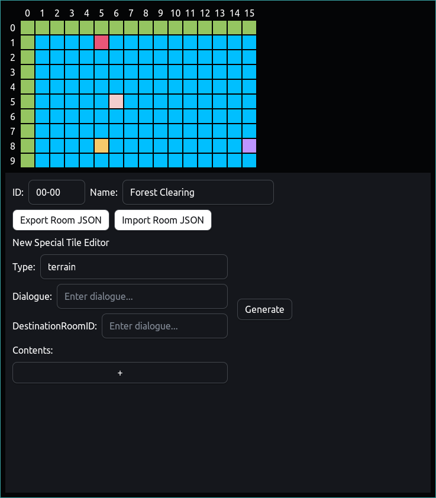

# Room Editor

<div align='center'>

</div>

# Installation/Build
Make sure you have rust installed
```bash
# git clone & cd into the repo
git clone https://github.com/ganhaque/port-moon.git && cd room-editor

# install dependencies
npm install

# you can run it by either
npm run tauri dev

# or build it using
npm run tauri build
```

